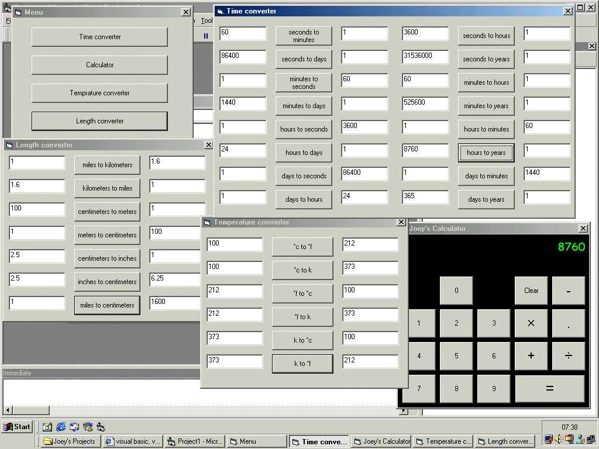



## Multi maths operator

### Description

this is a multi math operator system which contains : calculator, time converter, temprature converter and a length converter. please rate and/or comment.
 
### More Info
 

             |
---                |---
**Submitted On**   |2003-10-23 17:25:00
**By**             |[Joey Daly](https://github.com/Planet-Source-Code/PSCIndex/blob/master/ByAuthor/joey-daly.md)
**Level**          |Beginner
**User Rating**    |4.7 (14 globes from 3 users)
**Compatibility**  |VB 5\.0, VB 6\.0
**Category**       |[Math/ Dates](https://github.com/Planet-Source-Code/PSCIndex/blob/master/ByCategory/math-dates__1-37.md)
**World**          |[Visual Basic](https://github.com/Planet-Source-Code/PSCIndex/blob/master/ByWorld/visual-basic.md)
**Archive File**   |[Multi\_math16626810242003\.zip](https://github.com/Planet-Source-Code/joey-daly-multi-maths-operator__1-49418/archive/master.zip)

